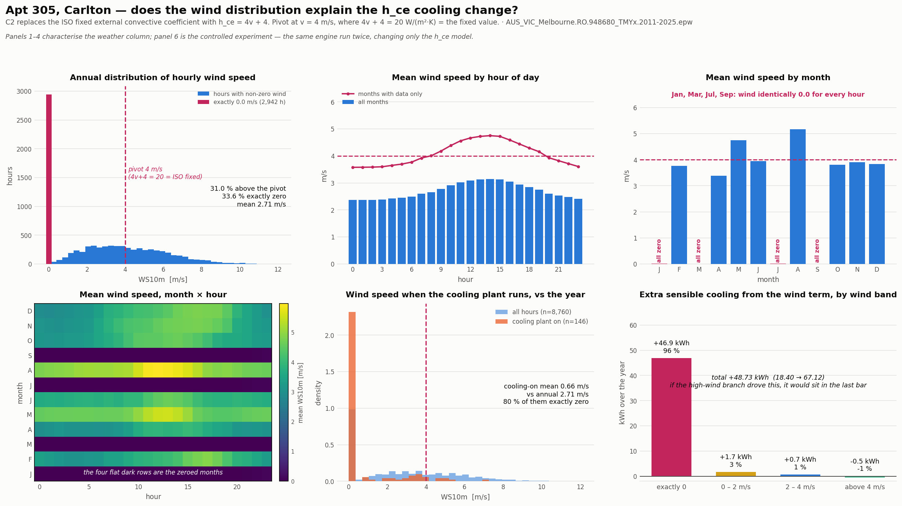

# Wind-speed diagnostic — does the distribution explain the h_ce cooling change?

## Verdict: **(c)**

**Neither (a) nor (b).** The increase is not produced by the high-wind branch of `4v + 4` at all, and the cooling hours are not windier than the year — they are very much calmer. Escalated below rather than papered over.

## The two headline numbers

| | |
| --- | ---: |
| Hours above the 4 m/s pivot | **31.0 %** of the year |
| Mean wind speed, whole year | **2.71 m/s** |
| Mean wind speed, cooling-plant-on hours | **0.66 m/s** — *0.24× the annual mean, i.e. far calmer, not windier* |

## The controlled experiment

The same engine, run twice, changing only the h_ce model (`external_convection_model` / `window_convection_model` = `table` recovers the ISO constant exactly). Nothing else differs — no worktree, no other correction.

| h_ce model | Sensible heating (kWh) | Sensible cooling (kWh) | Cooling-plant hours |
| --- | ---: | ---: | ---: |
| ISO fixed, 20 W/(m²·K) | 123.42 | 18.40 | 63 |
| dynamic, 4v + 4 | 122.69 | 67.12 | 146 |
| **change** | **-0.73** | **+48.73** | **+83** |

### Where that cooling comes from, by wind band

| Wind band | Hours | Extra sensible cooling (kWh) | Share |
| --- | ---: | ---: | ---: |
| exactly 0 | 2,942 | +46.91 | 96.3 % |
| 0 – 2 m/s | 937 | +1.66 | 3.4 % |
| 2 – 4 m/s | 2,072 | +0.69 | 1.4 % |
| above 4 m/s | 2,809 | -0.53 | -1.1 % |

**96.3 % of the increase comes from hours where the wind column reads exactly 0.0 m/s.** The hours above the pivot — where readings (a) and (b) both said the effect should live — contribute -0.53 kWh, i.e. very slightly *less* cooling, which is the correct sign for tighter coupling on a façade that is usually warmer than the air it faces.

## The actual mechanism

It is the **low**-wind branch, not the high-wind branch. At v = 0 the model gives h_ce = 4 W/(m²·K) against the ISO constant's 20 — a five-fold *reduction* in the external film coefficient. Apt 305's only exposed surface is a west-facing wall with a solar absorptance of 0.75. Weaken its external film on a sunny afternoon and the surface sheds much less heat to the air, so its temperature climbs, the sol-air driving temperature climbs with it, and more heat is conducted inward. The zone crosses its 26 °C cooling setpoint in hours where it previously did not.

That is visible in the plant state directly: the wind term adds 85 cooling-plant hours, of which 92 % are hours with exactly zero wind (mean 0.20 m/s). The cooling hours are calm *because* the model made them cooling hours — the causality runs from the coefficient to the plant state, not the other way round.

## Escalation: the wind column is not usable as it stands

Screening the EPW's wind field by month shows that **Jan, Mar, Jul, Sep carry a wind speed of exactly 0.0 m/s for every hour** — 2,952 hours, 33.7 % of the year — while the remaining months have a smooth distribution resolved to 0.1 m/s and average 4.08 m/s.

| Month | Hours | Zero-wind share | Mean (m/s) | Cooling-plant hours |
| --- | ---: | ---: | ---: | ---: |
| Jan ⚠ | 744 | 100 % | 0.01 | 84 |
| Feb | 672 | 0 % | 3.77 | 11 |
| Mar ⚠ | 744 | 100 % | 0.00 | 26 |
| Apr | 720 | 0 % | 3.39 | 0 |
| May | 744 | 0 % | 4.76 | 0 |
| Jun | 720 | 0 % | 3.95 | 0 |
| Jul ⚠ | 744 | 100 % | 0.01 | 0 |
| Aug | 744 | 0 % | 5.17 | 0 |
| Sep ⚠ | 720 | 100 % | 0.01 | 7 |
| Oct | 744 | 0 % | 3.81 | 2 |
| Nov | 720 | 0 % | 3.90 | 6 |
| Dec | 744 | 0 % | 3.84 | 10 |

A meteorological record does not produce four entire months of exactly zero wind between eight months averaging 4.08 m/s. These are missing or zeroed data, not calm. The EPW's own missing-value code for wind speed (999) appears nowhere in the file, so the gap is silent: nothing in the file marks those hours as absent, and the engine reads them as genuine calms.

**This matters directly for the result.** Two of the four zeroed months — January and March — are the peak cooling months, and 117 of the 146 cooling-plant hours fall inside them. Combined with the finding above — that 96 % of the h_ce cooling increase comes from exactly-zero-wind hours — the conclusion is that the +48.73 kWh is substantially an artefact of the weather file, not a property of the correlation.

### What this does *not* say

The implementation of `4v + 4` is faithful: `simplecombined` returns `4 + 4u`, floored by `external_convection_h_min`, and reduces to the ISO constant at 4 m/s exactly as documented. The defect is in the input, not the formula. Equally, this does not show the correction is wrong in principle — on a wind record with all twelve months present it may well behave as the literature expects.

### Recommended, not done here

Out of scope for this task, and listed rather than actioned:

1. Re-source the wind column, or splice those four months from another year of the same station, and re-run the controlled experiment above. That single number — the change in sensible cooling on a sound wind record — is what the paper should defend.
2. Until then, **do not present the 20.06 → 67.12 kWh cooling change as a physical finding about wind-dependent convection.** With the ISO fixed coefficient the same engine gives 18.40 kWh.
3. Consider whether the engine should refuse, or at least warn, on a weather column with a degenerate month — a silent third of a year at exactly zero is the kind of input that should not pass quietly.

## Effect on the canonical figure

The canonical result is **unchanged by this diagnostic** and remains 122.69 kWh sensible heating + 67.12 kWh sensible cooling + 3.98 kWh gated latent = 193.79 kWh = 9.69 kWh/m²·yr. This is a diagnosis, not a correction: nothing here has been altered in the engine, and the number is reported as it stands. What it adds is that the cooling component of that figure carries a 48.73 kWh contribution traceable to zero-wind hours in months whose wind data is missing, and that needs resolving before the h_ce correction is defended in the text.

Generated by `tools/diagnostics/wind_h_ce_diagnostic.py`.
