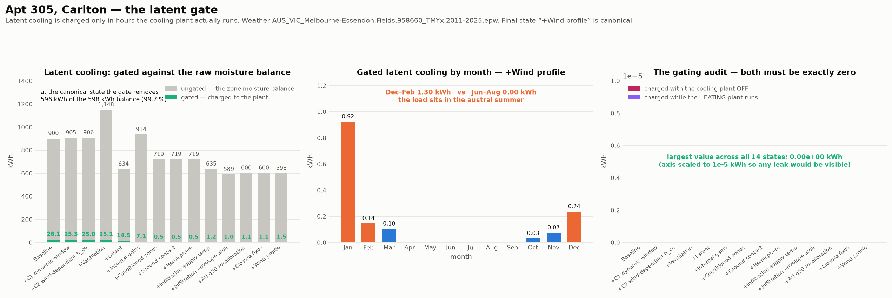

# The latent gate

**Latent charged with the plant off, or while heating: zero on every state — PASS.**

Weather `AUS_VIC_Melbourne-Essendon.Fields.958660_TMYx.2011-2025.epw`. All numbers read from the Part 2 trajectory's raw output — no re-measurement.

## Per state

| State | Cooling on (h) | Heating on (h) | Latent charged (h) | Gated (kWh) | Ungated (kWh) | Removed by the gate (kWh) | Charged, plant off | Charged while heating | Latent heating (kWh) |
| --- | ---: | ---: | ---: | ---: | ---: | ---: | ---: | ---: | ---: |
| Baseline | 851 | 2,790 | 178 | 26.12 | 900.05 | 873.93 | 0.000000 | 0.000000 | 152.6506 |
| +C1 dynamic window | 834 | 2,808 | 173 | 25.34 | 905.27 | 879.93 | 0.000000 | 0.000000 | 152.7140 |
| +C2 wind-dependent h_ce | 813 | 2,817 | 171 | 25.02 | 906.29 | 881.27 | 0.000000 | 0.000000 | 152.9055 |
| +Ventilation | 670 | 3,166 | 149 | 25.10 | 1,148.49 | 1,123.38 | 0.000000 | 0.000000 | 184.9387 |
| +Latent | 670 | 3,166 | 631 | 14.53 | 634.24 | 619.70 | 0.000000 | 0.000000 | 0.0047 |
| +Internal gains | 335 | 4,636 | 305 | 7.07 | 934.29 | 927.22 | 0.000000 | 0.000000 | 0.0157 |
| +Conditioned zones | 24 | 817 | 21 | 0.53 | 718.56 | 718.03 | 0.000000 | 0.000000 | 0.0000 |
| +Ground contact | 24 | 817 | 21 | 0.53 | 718.56 | 718.03 | 0.000000 | 0.000000 | 0.0000 |
| +Hemisphere | 24 | 817 | 21 | 0.53 | 718.56 | 718.03 | 0.000000 | 0.000000 | 0.0000 |
| +Infiltration supply temp | 58 | 654 | 51 | 1.22 | 634.98 | 633.76 | 0.000000 | 0.000000 | 0.0000 |
| +Infiltration envelope area | 51 | 559 | 45 | 1.05 | 589.33 | 588.28 | 0.000000 | 0.000000 | 0.0000 |
| +AU q50 recalibration | 54 | 575 | 47 | 1.14 | 600.11 | 598.97 | 0.000000 | 0.000000 | 0.0000 |
| +Closure fixes | 54 | 575 | 47 | 1.14 | 600.11 | 598.97 | 0.000000 | 0.000000 | 0.0000 |
| +Wind profile | 73 | 580 | 66 | 1.51 | 597.86 | 596.35 | 0.000000 | 0.000000 | 0.0000 |

`Ungated` is the zone moisture balance before the plant-on gate. It is a **diagnostic contrast column and never part of any total** — it is shown so the size of what the gate removes is visible rather than implied.

## Southern-hemisphere phase, canonical state

| Jan | Feb | Mar | Apr | May | Jun | Jul | Aug | Sep | Oct | Nov | Dec |
| ---: | ---: | ---: | ---: | ---: | ---: | ---: | ---: | ---: | ---: | ---: | ---: |
| 0.92 | 0.14 | 0.10 | 0.00 | 0.00 | 0.00 | 0.00 | 0.00 | 0.00 | 0.03 | 0.07 | 0.24 |

Dec–Feb 1.30 kWh against Jun–Aug 0.00 kWh. A gate built around a northern-hemisphere cooling season would put the load in the middle of this table; it does not.

