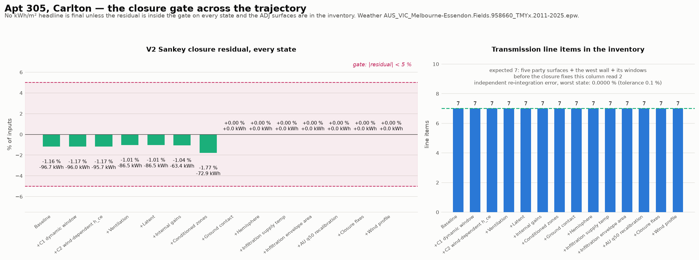

# The closure gate across the trajectory

**V2 residual < 5 % on every state: PASS.** **7 transmission line items on every state: PASS.** **Independent re-integration within 0.1 %: PASS.**

Weather `AUS_VIC_Melbourne-Essendon.Fields.958660_TMYx.2011-2025.epw`. Read from the Part 2 trajectory's raw output — no re-measurement.

| State | Inputs (kWh) | Outputs (kWh) | Storage (kWh) | V2 residual (kWh) | V2 residual (%) | < 5 %? | Transmission items | Re-integration error |
| --- | ---: | ---: | ---: | ---: | ---: | :-: | ---: | ---: |
| Baseline | 8,305.56 | 8,402.28 | 0.00 | -96.72 | -1.16 % | PASS | 7 | 0.0000 % |
| +C1 dynamic window | 8,195.65 | 8,291.62 | 0.00 | -95.97 | -1.17 % | PASS | 7 | 0.0000 % |
| +C2 wind-dependent h_ce | 8,148.11 | 8,243.80 | 0.00 | -95.69 | -1.17 % | PASS | 7 | 0.0000 % |
| +Ventilation | 8,517.97 | 8,604.42 | 0.00 | -86.45 | -1.01 % | PASS | 7 | 0.0000 % |
| +Latent | 8,517.97 | 8,604.42 | 0.00 | -86.45 | -1.01 % | PASS | 7 | 0.0000 % |
| +Internal gains | 6,070.40 | 6,133.78 | 0.00 | -63.38 | -1.04 % | PASS | 7 | 0.0000 % |
| +Conditioned zones | 4,117.26 | 4,190.15 | 0.00 | -72.88 | -1.77 % | PASS | 7 | 0.0000 % |
| +Ground contact | 4,115.73 | 4,115.73 | 0.00 | +0.00 | +0.00 % | PASS | 7 | 0.0000 % |
| +Hemisphere | 4,115.73 | 4,115.73 | 0.00 | +0.00 | +0.00 % | PASS | 7 | 0.0000 % |
| +Infiltration supply temp | 3,883.04 | 3,883.04 | -0.00 | +0.00 | +0.00 % | PASS | 7 | 0.0000 % |
| +Infiltration envelope area | 3,716.27 | 3,716.27 | 0.00 | +0.00 | +0.00 % | PASS | 7 | 0.0000 % |
| +AU q50 recalibration | 3,757.06 | 3,757.06 | 0.00 | +0.00 | +0.00 % | PASS | 7 | 0.0000 % |
| +Closure fixes | 3,757.06 | 3,757.06 | 0.00 | +0.00 | +0.00 % | PASS | 7 | 0.0000 % |
| +Wind profile | 3,822.50 | 3,822.50 | 0.00 | +0.00 | +0.00 % | PASS | 7 | 0.0000 % |

Largest excursion: **-1.77 %** at *+Conditioned zones*. From `+Ground contact` onward the residual is machine-zero — that fix removes the phantom ground term, which is the only thing the earlier states had left to shed.

The three conditions are not interchangeable. A small residual on an inventory that is missing 88.6 % of the envelope UA would be a balance that closes over the wrong control volume, which is exactly the state this whole effort started from — hence the line-item count and the independent re-integration are checked alongside it.

