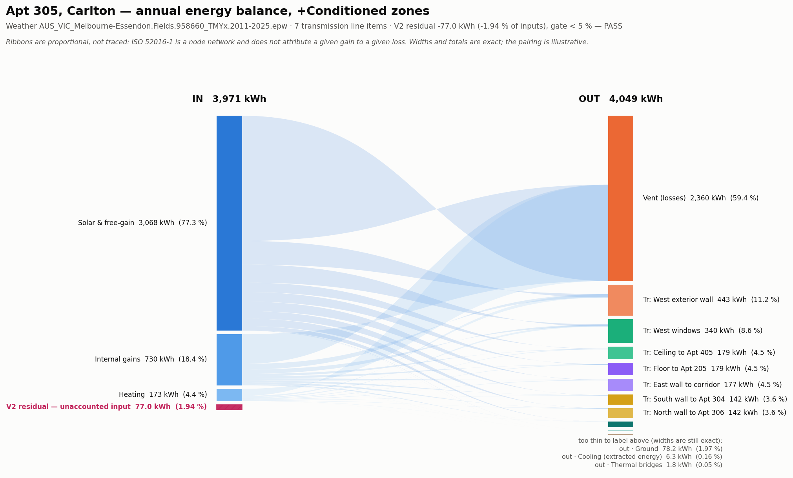

# Annual energy balance — +Conditioned zones

**V2 closure residual -77.02 kWh (-1.94 % of inputs) — PASS against the 5 % gate.** **7 transmission line items — PASS.** **Independent re-integration PASS (0.0000 %).**

Apt 305, 50 Barry St Carlton, 20 m². Weather `AUS_VIC_Melbourne-Essendon.Fields.958660_TMYx.2011-2025.epw`. Inventory taken from the closure-capable instrument, not from the annual balance columns.

The residual is computed exactly as the engine's own `SANKEY CHECK` line does:

```
inputs   = heating + internal gains + solar & free-gain
outputs  = cooling + ventilation + thermal bridges + ground
           + per-surface transmission (positive branches only)
residual = inputs - outputs - storage
```

`Transmission (residual)` is **excluded** from the outputs sum. It is the residual re-published as a flow, and including it would make the balance close by construction — the diagram could then never fail, which would make it useless as a check.



## Inputs

| Term | kWh | % of inputs |
| --- | ---: | ---: |
| Solar & free-gain | 3,068.38 | 77.3 % |
| Internal gains | 730.29 | 18.4 % |
| Heating | 172.82 | 4.4 % |
| **Total in** | **3,971.49** | **100.0 %** |

## Outputs

| Term | kWh | % of inputs |
| --- | ---: | ---: |
| Ventilation (losses) | 2,359.74 | 59.4 % |
| Transmission - West exterior wall (opaque) | 442.93 | 11.2 % |
| Transmission - West window - fixed + West window - operable | 340.01 | 8.6 % |
| Transmission - Ceiling to Apt 405 | 179.34 | 4.5 % |
| Transmission - Floor to Apt 205 | 179.34 | 4.5 % |
| Transmission - East wall to corridor | 177.23 | 4.5 % |
| Transmission - South wall to Apt 304 | 141.78 | 3.6 % |
| Transmission - North wall to Apt 306 | 141.78 | 3.6 % |
| Ground | 78.23 | 2.0 % |
| Cooling (extracted energy) | 6.34 | 0.2 % |
| Thermal bridges | 1.81 | 0.0 % |
| **Total out** | **4,048.51** | **101.9 %** |

| | kWh | % of inputs |
| --- | ---: | ---: |
| Energy accumulated in the zone (storage) | +0.00 | +0.00 % |
| **V2 closure residual** | **-77.02** | **-1.94 %** |

## The transmission inventory

The five party surfaces are 75.10 m², 88.6 % of the envelope UA. Before the closure fixes they appeared on neither side of this balance and the inventory listed two line items for a building with seven surfaces. It now lists **7**.

| Surface | kWh |
| --- | ---: |
| West exterior wall (opaque) | 442.93 |
| West window - fixed + West window - operable | 340.01 |
| Ceiling to Apt 405 | 179.34 |
| Floor to Apt 205 | 179.34 |
| East wall to corridor | 177.23 |
| South wall to Apt 304 | 141.78 |
| North wall to Apt 306 | 141.78 |
| **Σ reported** | **1,602.40** |
| Σ independently re-integrated from the hourly frame | 1,602.40 |

The two come from different code paths — the reported figure from the in-loop accumulator, the independent one re-integrated from the hourly frame afterwards — and agree to 0.0000 %, inside the 0.1 % consistency check.

