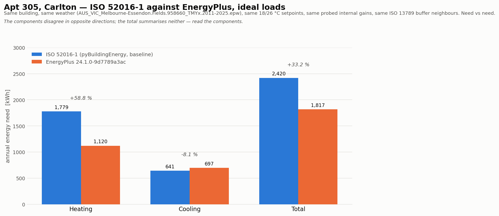

# Engine validation — ISO 52016-1 vs EnergyPlus, on the clean weather file

Both sides on `AUS_VIC_Melbourne-Essendon.Fields.958660_TMYx.2011-2025.epw`, the same building (Apt 305, 50 Barry St Carlton, 20 m²), the same setpoints (18 °C heating / 26 °C cooling, setback 15 / 28), and the same internal-gain, ventilation and adjacency inputs — each asserted below, not assumed.

EnergyPlus EnergyPlus, Version 24.1.0-9d7789a3ac, ideal-loads air system, so the comparison is **need vs need** and not system-sized. ISO side is the **unmodified vendored engine** (`2e6e910`) with the closure commits cherry-picked on top for reporting only — byte-identical physics to the vendored baseline, and the same object as row 1 of the canonical trajectory.

## 1. The comparison

| Metric | ISO 52016-1 (kWh) | EnergyPlus (kWh) | diff (kWh) | diff (%) | ISO (kWh/m²) | E+ (kWh/m²) |
| --- | ---: | ---: | ---: | ---: | ---: | ---: |
| Heating | 1,779.36 | 1,120.25 | +659.12 | +58.8 % | 88.97 | 56.01 |
| Cooling | 640.84 | 697.16 | -56.33 | -8.1 % | 32.04 | 34.86 |
| Total | 2,420.20 | 1,817.41 | +602.79 | +33.2 % | 121.01 | 90.87 |

## 2. What the numbers say

**Heating: ISO over-predicts EnergyPlus by 659.12 kWh (58.8 %).**

**Cooling: ISO under-predicts EnergyPlus by 56.33 kWh (8.1 %).**

**Total: +602.79 kWh (+33.2 %).** 

The two component errors have **opposite signs**, so they partly offset — but not enough to flatter the total, which at 33.2 % is worse than the cooling error (8.1 %) and better than the heating error (58.8 %). The total here is a weighted average of two different disagreements and summarises neither. Quote the components.

### Does the earlier heating-under / cooling-over pattern persist?

**No. It inverts.**

| | Heating: ISO vs E+ | Cooling: ISO vs E+ |
| --- | ---: | ---: |
| Superseded — RO 948680 weather, party surfaces typed `opaque` (buried as GR) | 15.9 vs 766.2 kWh (**-98 %**) | 2,027.5 vs 900.4 kWh (**+125 %**) |
| This run — Essendon, party surfaces typed `adjacent` | 1,779.4 vs 1,120.2 kWh (**+58.8 %**) | 640.8 vs 697.2 kWh (**-8.1 %**) |

**Attribute this to the building, not to the weather.** Two inputs differ between those rows, and only one of them matters much:

1. **The building typing — dominant.** The superseded table was run with the five party surfaces typed `"opaque"`. With `sky_view_factor: 0` the core maps that to **GR — slab-on-ground**, so a third-floor apartment was modelled with 75.10 m² of buried envelope, its ceiling included. Buried surfaces sit near stable ground temperature, which is why that model needed almost no heating (15.9 kWh) and enormous cooling (2 027.5 kWh). On one engine and one weather file the two typings give **15.86 / 2 027.5** against **1 308.60 / 741.83** kWh — measured, in `results/diagnostics/README.md`, finding 1. That single input change is larger than everything else in this report combined.
2. **The weather — secondary here.** Essendon is windier and slightly cooler than the RO file's usable months, which raises heating and lowers cooling, but by tens of kWh, not thousands.

So the correct statement for the paper is *not* "ISO under-predicts heating and over-predicts cooling". That was a property of a mis-specified model. On the canonical building the direction is the other way round: **ISO over-predicts heating substantially and tracks cooling to within 8 %.**

Quote the components. The total belongs in the table, not in a sentence on its own.

### What this validates, and what it does not

This is the **baseline** engine — unmodified ISO 52016-1, before any of the nine corrections. The heating disagreement is the thing the correction trajectory then addresses; it is the *starting* discrepancy, not a residual one. Reading it as the paper's final accuracy claim would be wrong in the opposite direction from the old table.

## 3. The inputs, asserted to match

Every row was read back from what the ISO engine actually loaded and compared with what went into the IDF. A mismatch here would make the comparison meaningless, so the run aborts rather than reporting one.

| Input | ISO side | EnergyPlus side | Match |
| --- | --- | --- | :-: |
| Weather file | AUS_VIC_Melbourne-Essendon.Fields.958660_TMYx.2011-2025.epw | AUS_VIC_Melbourne-Essendon.Fields.958660_TMYx.2011-2025.epw | yes |
| Net floor area | 20.0 m² | 20.0 m² | yes |
| Heating setpoint / setback | 18.0 / 15.0 °C | 18.0 / 15.0 °C | yes |
| Cooling setpoint / setback | 26.0 / 28.0 °C | 26.0 / 28.0 °C | yes |
| Control temperature | operative (0.5 air + 0.5 MRT) | operative (ZoneControl:Thermostat:OperativeTemperature, 0.5) | yes |
| Internal gains | probed from the engine: occupants 616.1 W, appliances 440.1 W, lighting 0.0 W | OtherEquipment at the probed watts, same hourly profiles | yes |
| Internal-gain radiant fraction | f_int_c = 0.4 → 0.6 radiant | 0.6 radiant | yes |
| Outdoor air | 2.0 l/(s·m²) | DesignSpecification:OutdoorAir Flow/Area 0.002 m³/(s·m²) | yes |
| Adjacent surfaces | 5 party surfaces, ISO 13789 unconditioned buffer (baseline ignores `conditioned: True`) | OtherSideCoefficients, N4 = b_ztu, N7 = 1 − b_ztu (no surface is Outdoors) | yes |
| Exposed surfaces | west wall + 2 windows only | WestWall (Outdoors, SunExposed) + 2 fenestration surfaces | yes |
| Window frame fraction | 0.25 on solar, not on conduction | SHGC scaled by 0.75, U unchanged | yes |
| Zone internal capacitance | c_int = 10 000 J/(m²·K) | InternalMass, 10 000 J/(m²·K) over the floor area | yes |
| Plant | ideal loads (need, not system) | ZoneHVAC:IdealLoadsAirSystem, NoLimit | yes |
| Latent handling | reported separately, not in sensible | ConstantSupplyHumidityRatio (sensible-only cooling) | yes |
| Holidays / daylight saving | not modelled | No / No | yes |

### The one that inverts the answer if you get it wrong

The five party surfaces are declared `conditioned: True`. **The baseline engine ignores that** — holding conditioned neighbours at their setpoint is the Issue-7 fix (`7339076`), which is trajectory state 7, not the baseline. The baseline runs all five through the ISO 13789 *unconditioned buffer* model, so they mostly track outdoor air.

The IDF therefore reproduces the buffer rather than pinning the neighbours at 20 °C, using EnergyPlus `OtherSideCoefficients` with `N4 = b_ztu`, `N7 = 1 − b_ztu`, which is the ISO `theta_ztu` expression term for term. The b_ztu values are probed out of the ISO engine, not recomputed, so the IDF cannot drift from the run:

| Adjacent zone | b_ztu (from the ISO engine) | Declared `conditioned` |
| --- | ---: | :-: |
| apt_above | 0.926000 | True |
| apt_below | 0.926000 | True |
| apt_north | 0.867000 | True |
| apt_south | 0.867000 | True |
| corridor | 0.733000 | True |

Internal gains are probed for the same reason: the engine substitutes ISO 16798-1 tabulated q_int for the building type class and **ignores** the dictionary's `full_load` values, so matching the dictionary would not match the engine.

| Gain | Dictionary `full_load` (W/m²) | Engine, probed (W) | In the IDF (W) |
| --- | ---: | ---: | ---: |
| occupants | 8.00 (= 160.0 W) | 616.14 | 616.14 |
| appliances | 5.00 (= 100.0 W) | 440.10 | 440.10 |
| lighting | 3.00 (= 60.0 W) | 0.00 | 0.00 |

The engine's total internal gain is 5,356.69 kWh/yr — 30.6 W/m² averaged over the year, against the dictionary's nominal 16 W/m² peak. The gap is the neighbour-transfer term the baseline adds and the de-inflation fix (trajectory state 6) later removes; it is an input both engines share here, not a difference between them.

### The declared window overhang is a no-op, verified

`build_idf` generates no shading surface. If the dictionary's declared 0.25 m overhang did anything on the ISO side, the two engines would differ by an *input*. Both dictionaries were run and compared on this weather file rather than the claim being inherited:

| | Heating (kWh) | Cooling (kWh) | Solar gains (kWh) |
| --- | ---: | ---: | ---: |
| declared | 1,779.360276 | 640.836966 | 810.539987 |
| overhang stripped | 1,779.360276 | 640.836966 | 810.539987 |
| **max |Δ|** | 0.000e+00 | | |

Bit-identical, so omitting the shading surface from the IDF matches the ISO run exactly.

## 4. Provenance

* weather: `/home/user/AIB/weather_cache/AUS_VIC_Melbourne-Essendon.Fields.958660_TMYx.2011-2025.epw`
* ISO engine: `2e6e910` + closure commits `6e549fa18`, `82a909d3f`, `9fd8c696c`, `09357302f`
* ISO result asserted equal to the canonical trajectory's `Baseline` row (max |Δ| 0.000e+00 kWh)
* EnergyPlus: EnergyPlus, Version 24.1.0-9d7789a3ac, ideal loads, timestep 6/h, 2 warnings
* neighbour model in the IDF: `iso-bztu` (ISO 13789 unconditioned buffer, matching the baseline engine)
* IDF: `apt305.idf` in this directory

