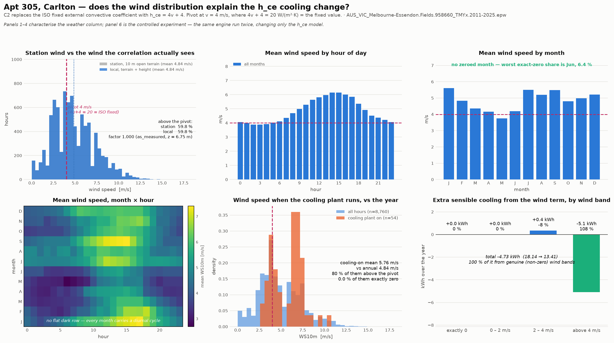

# Wind-speed diagnostic on the clean weather file — does the distribution explain the h_ce cooling change?

Weather: `AUS_VIC_Melbourne-Essendon.Fields.958660_TMYx.2011-2025.epw`. The h_ce correlation is driven by the **raw 10 m station column**, unadjusted for terrain or height. This is the *before* state for the wind-profile question, produced on the current engine tree so that the contrast isolates the wind and nothing else.

## Verdict: **(a+b)**

**(a) and (b) together**: the year is windier than the pivot *and* the cooling hours are windier still.

## The sign of C2, on the terrain-corrected wind

The h_ce correlation is now driven by the wind **local to the wall** — terrain `as_measured` (a = None, δ = 0 m) at z = 6.75 m, a factor of **1.0000** on the 10 m station column.

| | Station wind (as previously run) | Terrain-corrected (this run) |
| --- | ---: | ---: |
| Annual mean wind | 4.84 m/s | **4.84 m/s** |
| Hours above the 4 m/s pivot | 59.8 % | **59.8 %** |
| Mean h_ce implied | 23.36 W/(m²·K) (+3.36 vs the ISO 20) | **23.36 W/(m²·K)** (+3.36) |

**C2 on sensible cooling: -4.73 kWh** — it reduces it. No prior summary was supplied via `--compare-to`, so the before/after contrast is omitted rather than retyped from memory.

## The three questions, answered

| Question | Answer |
| --- | --- |
| Is the C2 cooling change explained by the real wind distribution? | **Yes** — 100.0 % of the -4.73 kWh comes from hours with genuine, non-zero wind |
| Do cooling-plant-on hours coincide with above-pivot wind? | **79.6 %** of the 54 cooling hours are above 4 m/s, against 59.8 % of the year — they are windier than the year |
| How much of the delta comes from genuine (non-zero) wind bands? | **-4.73 kWh of -4.73 kWh (100.0 %)**; the exactly-zero bucket contributes +0.00 kWh over 138 hours |

## The wind column itself

| | |
| --- | ---: |
| Hours above the 4 m/s pivot | **59.8 %** of the year |
| Mean wind speed, whole year | **4.84 m/s** |
| Median / max | 4.60 / 18.0 m/s |
| Hours reading exactly 0.0 m/s | 1.58 % |
| Months with a degenerate (all-zero) column | **none** |
| Mean h_ce implied over the year | 23.36 W/(m²·K), i.e. +3.36 against the ISO fixed 20 |
| Mean wind, cooling-plant-on hours | **5.76 m/s** — 1.19× the annual mean |
| Mean h_ce over cooling-plant-on hours | 27.04 W/(m²·K), i.e. +7.04 against the fixed value |

**No calendar month is dead-calm.** The worst exact-zero share is Jun at 6.4 %, and every month carries a diurnal cycle (panel 4). This is the specific defect that invalidated the previous run, so it is checked directly rather than assumed — and the harness now aborts on it (`tools/diagnostics/weather_integrity.py`).

## The controlled experiment

The same engine, run twice, changing only the h_ce model (`external_convection_model` / `window_convection_model` = `table` recovers the ISO constant exactly). Nothing else differs — no worktree, no other correction.

| h_ce model | Sensible heating (kWh) | Sensible cooling (kWh) | Cooling-plant hours |
| --- | ---: | ---: | ---: |
| ISO fixed, 20 W/(m²·K) | 124.09 | 18.14 | 65 |
| dynamic, 4v + 4 | 123.74 | 13.41 | 54 |
| **change** | **-0.35** | **-4.73** | **-11** |

### Where that cooling change comes from, by wind band

| Wind band | Hours | Extra sensible cooling (kWh) | Share |
| --- | ---: | ---: | ---: |
| exactly 0 | 138 | +0.00 | 0.0 % |
| 0 – 2 m/s | 601 | +0.00 | 0.0 % |
| 2 – 4 m/s | 2,766 | +0.36 | -7.5 % |
| above 4 m/s | 5,255 | -5.08 | 107.5 % |

Share is of the **signed** total, so a band moving the same way as the total reads positive and a band opposing it reads negative; the four shares sum to 100 %. That is why a share can exceed 100 % when another band pulls the other way.

**100.0 % of the -4.73 kWh comes from hours with real, non-zero wind**, and the above-pivot band alone carries -5.08 kWh (107.5 %) over 5,255 hours. The exactly-zero bucket is now 138 hours and +0.00 kWh, 0.0 % of the total.

## The mechanism

With 59.8 % of hours above the pivot the dynamic coefficient sits **above** the ISO constant on the year (mean 23.36 against 20 W/(m²·K)), so the exposed west wall is coupled *more* tightly to outdoor air than ISO 13789's frozen value assumes.

Apt 305's only exposed surface is that west wall, solar absorptance 0.75. On a sunny afternoon it runs hotter than the air it faces, so a **stronger** external film sheds more of the absorbed solar back to the air, the sol-air driving temperature falls, and less heat is conducted inward. That is why the wind term lowers sensible cooling by 4.73 kWh here.

The plant state moves with it: the wind term changes the cooling-plant hour count by -11 (65 → 54).

Of the hours the dynamic model adds to the cooling plant (3), the mean wind is 3.23 m/s and 0.0 % read exactly zero.

## Month by month

| Month | Hours | Zero-wind share | Mean (m/s) | Cooling-plant hours |
| --- | ---: | ---: | ---: | ---: |
| Jan | 744 | 0.1 % | 5.60 | 27 |
| Feb | 672 | 1.6 % | 4.84 | 7 |
| Mar | 744 | 0.7 % | 4.36 | 3 |
| Apr | 720 | 1.5 % | 4.16 | 0 |
| May | 744 | 4.7 % | 3.75 | 0 |
| Jun | 720 | 6.4 % | 4.20 | 0 |
| Jul | 744 | 1.3 % | 5.50 | 0 |
| Aug | 744 | 1.1 % | 5.20 | 0 |
| Sep | 720 | 0.3 % | 5.49 | 0 |
| Oct | 744 | 0.8 % | 4.80 | 0 |
| Nov | 720 | 0.3 % | 4.98 | 4 |
| Dec | 744 | 0.1 % | 5.21 | 13 |

## Effect on the canonical figure

This is a diagnostic, not a correction: nothing in the engine was altered to produce it. What it establishes is that the C2 component of the canonical trajectory now rests on a wind record that is a wind record — 100.0 % of the C2 cooling effect comes from genuine wind bands, and the 0.0 % attributable to exactly-zero hours spans 138 hours (1.6 % of the year) rather than four fabricated months.

The canonical numbers themselves are in `results/paper/trajectory_v2/comparison.md`; this file does not restate them, so the two cannot drift apart.

Generated by `tools/diagnostics/wind_h_ce_diagnostic.py`.
