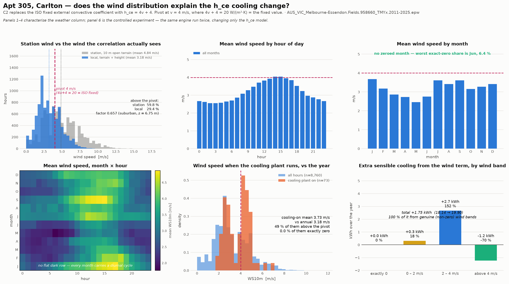

# Wind-speed diagnostic on the clean weather file — does the distribution explain the h_ce cooling change?

Weather: `AUS_VIC_Melbourne-Essendon.Fields.958660_TMYx.2011-2025.epw`. This **replaces the earlier verdict (c)**, which was reached on `AUS_VIC_Melbourne.RO.948680_TMYx.2011-2025.epw` and was a finding about that file's wind column rather than about the correlation.

## Verdict: **(b)**

**(b): high winds coincide with the cooling-season hours specifically**, so the cooling-season coupling is amplified beyond the year-round effect.

## The sign of C2, on the terrain-corrected wind

The h_ce correlation is now driven by the wind **local to the wall** — terrain `suburban` (a = 0.22, δ = 370 m) at z = 6.75 m, a factor of **0.6574** on the 10 m station column.

| | Station wind (as previously run) | Terrain-corrected (this run) |
| --- | ---: | ---: |
| Annual mean wind | 4.84 m/s | **3.18 m/s** |
| Hours above the 4 m/s pivot | 59.8 % | **29.4 %** |
| Mean h_ce implied | 23.36 W/(m²·K) (+3.36 vs the ISO 20) | **16.73 W/(m²·K)** (-3.27) |

**C2 on sensible cooling: -4.73 kWh before, +1.75 kWh now.**

**The sign reverses.** On the station wind C2 reduced sensible cooling by 4.73 kWh; on the terrain-corrected wind it increases it by 1.75 kWh. The reported C2 result did rest on an unstated terrain assumption, and correcting that assumption flips the direction of the correction. This is the finding the task exists to establish, and it is stated as it fell.

## The three questions, answered

| Question | Answer |
| --- | --- |
| Is the C2 cooling change explained by the real wind distribution? | **Yes** — 100.0 % of the +1.75 kWh comes from hours with genuine, non-zero wind |
| Do cooling-plant-on hours coincide with above-pivot wind? | **49.3 %** of the 73 cooling hours are above 4 m/s, against 29.4 % of the year — they are windier than the year |
| How much of the delta comes from genuine (non-zero) wind bands? | **+1.75 kWh of +1.75 kWh (100.0 %)**; the exactly-zero bucket contributes +0.00 kWh over 138 hours |

## The wind column itself

| | |
| --- | ---: |
| Hours above the 4 m/s pivot | **29.4 %** of the year |
| Mean wind speed, whole year | **3.18 m/s** |
| Median / max | 3.02 / 11.8 m/s |
| Hours reading exactly 0.0 m/s | 1.58 % |
| Months with a degenerate (all-zero) column | **none** |
| Mean h_ce implied over the year | 16.73 W/(m²·K), i.e. -3.27 against the ISO fixed 20 |
| Mean wind, cooling-plant-on hours | **3.73 m/s** — 1.17× the annual mean |
| Mean h_ce over cooling-plant-on hours | 18.91 W/(m²·K), i.e. -1.09 against the fixed value |

**No calendar month is dead-calm.** The worst exact-zero share is Jun at 6.4 %, and every month carries a diurnal cycle (panel 4). This is the specific defect that invalidated the previous run, so it is checked directly rather than assumed — and the harness now aborts on it (`tools/diagnostics/weather_integrity.py`).

## The controlled experiment

The same engine, run twice, changing only the h_ce model (`external_convection_model` / `window_convection_model` = `table` recovers the ISO constant exactly). Nothing else differs — no worktree, no other correction.

| h_ce model | Sensible heating (kWh) | Sensible cooling (kWh) | Cooling-plant hours |
| --- | ---: | ---: | ---: |
| ISO fixed, 20 W/(m²·K) | 124.09 | 18.14 | 65 |
| dynamic, 4v + 4 | 122.88 | 19.90 | 73 |
| **change** | **-1.21** | **+1.75** | **+8** |

### Where that cooling change comes from, by wind band

| Wind band | Hours | Extra sensible cooling (kWh) | Share |
| --- | ---: | ---: | ---: |
| exactly 0 | 138 | +0.00 | 0.0 % |
| 0 – 2 m/s | 1,903 | +0.32 | 18.2 % |
| 2 – 4 m/s | 4,141 | +2.67 | 152.3 % |
| above 4 m/s | 2,578 | -1.24 | -70.5 % |

Share is of the **signed** total, so a band moving the same way as the total reads positive and a band opposing it reads negative; the four shares sum to 100 %. That is why a share can exceed 100 % when another band pulls the other way.

**100.0 % of the +1.75 kWh comes from hours with real, non-zero wind**, and the above-pivot band alone carries -1.24 kWh (-70.5 %) over 2,578 hours. The exactly-zero bucket — the entire content of the earlier finding — is now 138 hours and +0.00 kWh, 0.0 % of the total.

## The mechanism

With 29.4 % of hours above the pivot the dynamic coefficient sits **above** the ISO constant for most of the year (mean 16.73 against 20 W/(m²·K)), so the exposed west wall is coupled *more* tightly to outdoor air than ISO 13789's frozen value assumes — the opposite of what the RO file produced, where h_ce collapsed to 4 W/(m²·K) across four fabricated dead-calm months.

Apt 305's only exposed surface is that west wall, solar absorptance 0.75. On a sunny afternoon it runs hotter than the air it faces, and a **weaker** external film sheds less of the absorbed solar back to the air: the sol-air driving temperature rises and more heat is conducted inward. With the local mean at 3.18 m/s the coefficient sits *below* the ISO constant for 70.6 % of the year, which is why the wind term raises sensible cooling by 1.75 kWh here — the opposite of what the same correlation does on the unadjusted station column.

The plant state moves with it: the wind term changes the cooling-plant hour count by +8 (65 → 73).

Of the hours the dynamic model adds to the cooling plant (11), the mean wind is 2.74 m/s and 0.0 % read exactly zero — against 96 % on the RO file, where the added hours *were* the fabricated calms.

## Month by month

| Month | Hours | Zero-wind share | Mean (m/s) | Cooling-plant hours |
| --- | ---: | ---: | ---: | ---: |
| Jan | 744 | 0.1 % | 3.68 | 32 |
| Feb | 672 | 1.6 % | 3.18 | 10 |
| Mar | 744 | 0.7 % | 2.86 | 7 |
| Apr | 720 | 1.5 % | 2.74 | 0 |
| May | 744 | 4.7 % | 2.46 | 0 |
| Jun | 720 | 6.4 % | 2.76 | 0 |
| Jul | 744 | 1.3 % | 3.61 | 0 |
| Aug | 744 | 1.1 % | 3.42 | 0 |
| Sep | 720 | 0.3 % | 3.61 | 0 |
| Oct | 744 | 0.8 % | 3.15 | 2 |
| Nov | 720 | 0.3 % | 3.27 | 6 |
| Dec | 744 | 0.1 % | 3.42 | 16 |

## Before and after

Same engine, same building, same weather file, same switch. The only difference is that the h_ce correlation is now fed the wind local to the wall rather than the raw 10 m station column.

| | station wind (before) | terrain-corrected (this run) |
| --- | ---: | ---: |
| Annual mean wind | 4.84 m/s | 3.18 m/s |
| Hours above the 4 m/s pivot | 59.8 % | 29.4 % |
| Hours exactly 0.0 m/s | 1.58 % | 1.58 % |
| Dead-calm months | none | none |
| Sensible cooling, ISO fixed h_ce | 18.14 kWh | 18.14 kWh |
| Sensible cooling, dynamic 4v + 4 | 13.41 kWh | 19.90 kWh |
| C2 effect on sensible cooling | -4.73 kWh | +1.75 kWh |
| Share of that from exactly-zero wind | 0.0 % | 0.0 % |
| Verdict | (a+b) | (b) |

Nothing in the correlation moved. `simplecombined` still returns `4 + 4u` and still reduces to the ISO constant at 4 m/s exactly. What moved is the wind fed to it, and with it which side of the pivot most of the year sits on.

## Effect on the canonical figure

This is a diagnostic, not a correction: nothing in the engine was altered to produce it. What it establishes is that the C2 component of the canonical trajectory now rests on a wind record that is a wind record — 100.0 % of the C2 cooling effect comes from genuine wind bands, and the 0.0 % attributable to exactly-zero hours spans 138 hours (1.6 % of the year) rather than four fabricated months.

The canonical numbers themselves are in `results/au_canonical_essendon/comparison.md`; this file does not restate them, so the two cannot drift apart.

Generated by `tools/diagnostics/wind_h_ce_diagnostic.py`.
